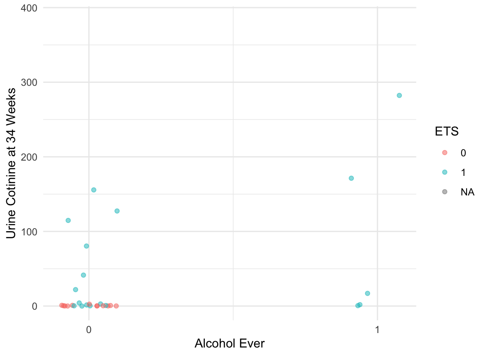

# PHP2550_Project1

## Title

Impacts of Smoking During Pregnancy and Environmental Tobacco Smoke on Self-regulation and Substance Use in Teenagers

## Description

Maternal smoking during pregnancy (SDP) and environmental tobacco smoke (ETS) exposure are known to be harmful for children’s neural development not only at birth but also over time. Previous studies have shown that SDP and ETS, separately, can cause poor performance in cognition and language as well as self-regulation problems (Margolis et al. 2023; He et al. 2018; Rashidi et al. 2020). This study aims to examine the association of SBP and ETS with self-regulation, externalizing behavior, and substance use on children both prenatally and postnatally. The participants were recruited from a previous intervention study that recorded the reported smoking exposure from mothers and urine cotinine level at 6 months postpartum (n=49).  This follow-up survey recorded the smoking exposure from 6 months to 5 years postpartum, substance use habits of mothers and children, and self- regulation related responses on children. We found SBP and ETS intensity positively correlated, and they seem to have additive effects on self-regularization problems and early substance usage in teenagers. Although the quality and consistency of data is concerning, this analysis can be used as a guidance when all participants’ answers will be collected or for other similar studies.

## Main Results

 

## Code Availability

The code used for processing, EDA, and generating the plots are in `EDA.R`. The code for generating the report `Project_1.pdf` is `Project_1.Rmd`. The images files are generated from `EDA.R` and attached in the report.

## Acknowledgement

This project is a collaboration with Dr. Lauren Micalizzi from the Department Behavioral and Social Science (lauren_micalizzi@brown.edu). This project is advised by Dr. Alice Paul (alice_paul@brown.edu)
